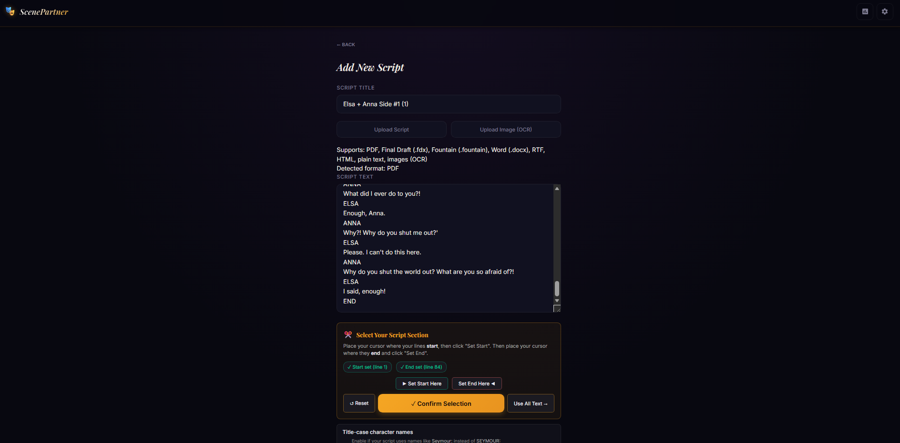
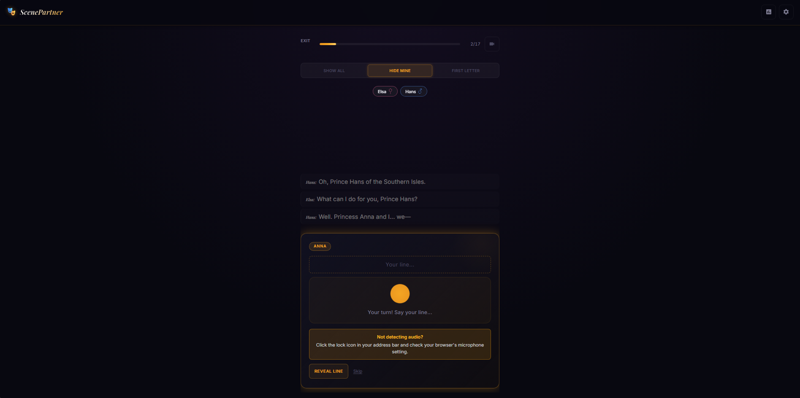
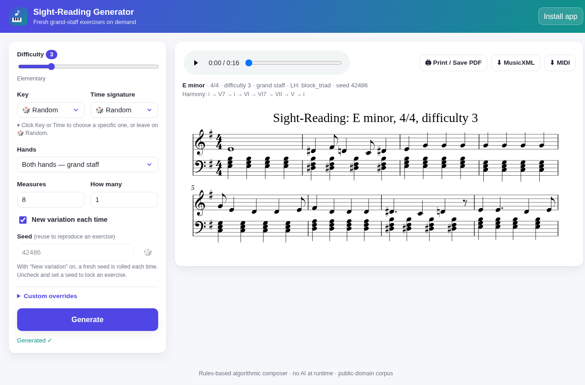
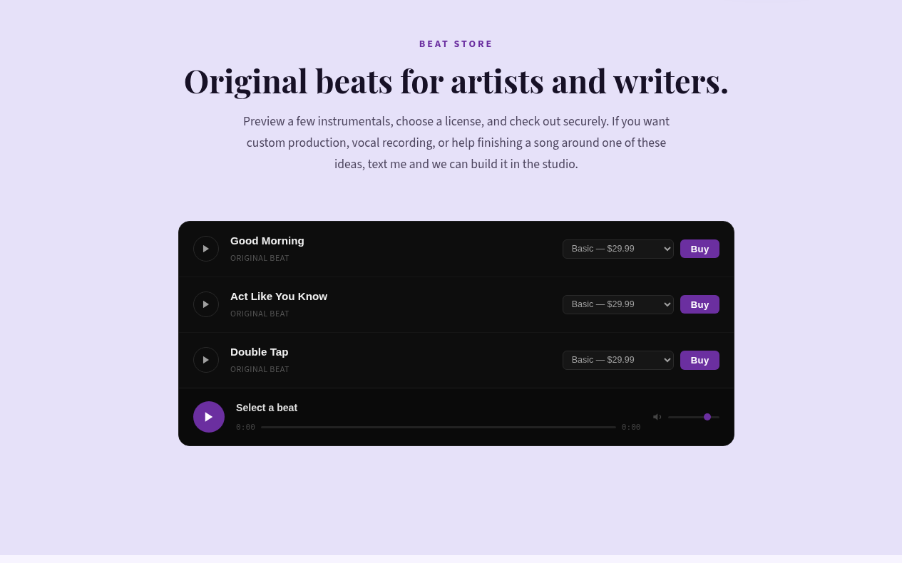
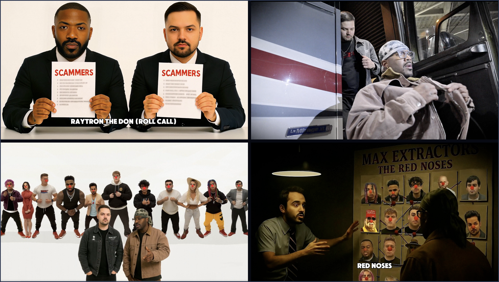
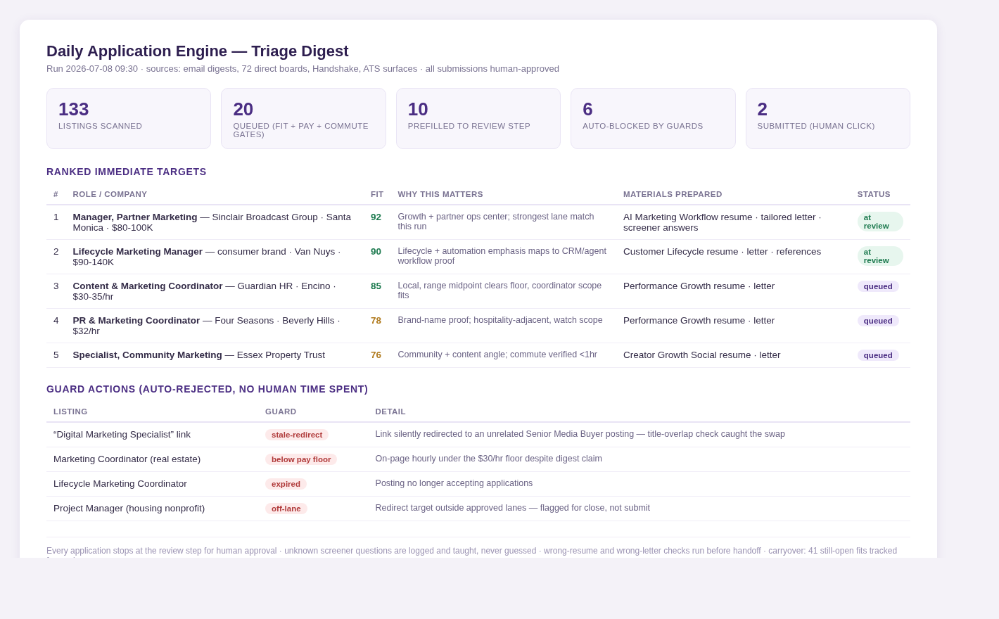
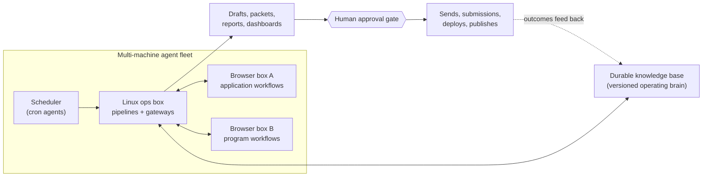

# Thaddeus Arndt
### Preballin / @preballin

**AI workflow builder, creative automation operator, and music/audio technologist.**

I build practical AI systems that connect agents, browsers, local infrastructure, creative tools, data pipelines, content workflows, and human approval loops. My work is focused on applied agent workflows, automation safety, music and audio tooling, and useful software that turns messy real-world processes into repeatable automated systems.

Portfolio: [preballin.com/portfolio](https://www.preballin.com/portfolio/)  
GitHub: [github.com/thaddeusarndt](https://github.com/thaddeusarndt)

## Built products

### Scene Partner — AI rehearsal app for actors

Feed it a script and it runs your scene with you: it reads the other roles, waits for your lines, and tracks where you are. Built end to end with an AI-assisted development workflow.

  
  

Full case study, product flow, and mock parse examples: [scene-partner-lab](https://github.com/thaddeusarndt/scene-partner-lab)

### Sight-Reading Generator — infinite practice material for music students

Generates fresh, level-appropriate sight-reading exercises on demand. Built for my own piano students, used in real weekly lessons.

### Beat Marketplace — creator commerce, end to end

A working digital marketplace with an in-page player and purchase flow, part of the content-driven growth loop on preballin.com.

### AI music video work — millions of views

AI-assisted music-video workflows (original music, Midjourney/Kling-era tooling, human final edit) for online communities, with videos accumulating millions of views across X and YouTube.

### Daily intelligence engine — automated triage with human approval gates

A scheduled agent system that scans 70+ sources daily, gates findings through fit/pay/location rules, prepares complete application materials, and stops everything at a human review step. Sanitized digest from a real run:

### Autolabel — AI record-label operations (in development)

An AI system that runs indie-label operations: fifteen specialized label roles (manager, release strategist, content director, A&R, data analyst, rights triage, and more) reviewing artists on a weekly cadence and producing label-grade release, content, and growth decisions behind human approval gates. Built on my decade running Renaissauce Records and serving 300+ musicians. Implementation is private; a results demo is available on request.

60-second overview:

https://github.com/thaddeusarndt/thaddeusarndt/raw/main/assets/autolabel-demo.mp4

Live product: [autolabel.studio](https://autolabel.studio/)

## The lab behind it

Everything above runs on a multi-machine agent operations system I built and operate daily:

Design rules: every risky action stops at a human gate, every run leaves an auditable trail, and every lesson gets crystallized back into the versioned knowledge base so the system gets permanently better instead of repeating mistakes.

## Featured public work

| Project | What it demonstrates |
|---|---|
| [Research Intelligence Systems](https://github.com/thaddeusarndt/research-intelligence-systems) | Clean-room research automation with synthetic fixtures, scoring, redaction, approval queues, generated reports, tests, and CI. |
| [Creative Audio Workflow Lab](https://github.com/thaddeusarndt/creative-audio-workflow-lab) | Music/audio workflow automation with synthetic metadata, release planning, prompt-safe content repurposing, generated reports, tests, and CI. |
| [AI Agent Workspace Lab](https://github.com/thaddeusarndt/ai-agent-workspace-lab) | Clean-room agent workspace patterns: mock tool routing, approval gates, and dry-run traces. |
| [Scene Partner Lab](https://github.com/thaddeusarndt/scene-partner-lab) | Public case study of the AI rehearsal app: product design, mock script parsing, and the AI-assisted dev workflow. |

All public repos are intentionally public-safe: no credentials, private client data, raw logs, production strategy, live account actions, or unpublished assets.

## Proof routes for hiring

- **AI workflow automation and implementation:** [research-intelligence-systems](https://github.com/thaddeusarndt/research-intelligence-systems) and [ai-agent-workspace-lab](https://github.com/thaddeusarndt/ai-agent-workspace-lab)
- **Approval-gated agent/workflow patterns:** [ai-agent-workspace-lab](https://github.com/thaddeusarndt/ai-agent-workspace-lab)
- **Music, audio, and creative workflow systems:** [creative-audio-workflow-lab](https://github.com/thaddeusarndt/creative-audio-workflow-lab)
- **Creative/media portfolio and public proof:** [preballin.com/portfolio](https://www.preballin.com/portfolio/)
- **Music teaching and customer education:** [thaddeusarndt.com](https://www.thaddeusarndt.com)

I keep sensitive/private systems private, but publish clean-room demos with synthetic data, redaction, dry-run traces, tests, and approval gates.

## What I build

- **AI agent workspaces** that coordinate coding agents, browser automation, local machines, scheduled jobs, and review checkpoints.
- **Human-in-the-loop automations** for research, lead discovery, document generation, browser handoff, content production, and approval-gated workflows.
- **Prompt and agent workflow systems** that turn vague goals into scoped tasks, context packs, verification loops, and reusable operating patterns.
- **Research and intelligence systems** for public-data collection, content-gap discovery, market monitoring, trend analysis, and structured reporting.
- **Web products and creator commerce systems** including portfolio sites, booking funnels, Stripe-enabled digital marketplaces, and content-driven growth loops.
- **Creative AI systems** around music, audio production, content automation, artist workflows, and media operations.
- **Consumer app prototypes** that turn niche creative workflows into usable software, including theater, music, and practice tools.

## Public repo pipeline

I am packaging private/project-history work into sanitized public repos and case studies. The emphasis is clean-room examples, synthetic fixtures, clear boundaries, reproducible demos, and security review before publishing.

Planned public-safe directions:

1. **AI Agent Workspace Lab** - multi-device agent operations, browser handoff, scheduled jobs, mock configs, and approval boundaries.
2. **Approval-Gated Automation Patterns** - workflows that research, draft, prepare, and report while stopping before sensitive actions.
3. **Creative Audio Workflow Lab** - music/audio production utilities, metadata workflows, content repurposing, and AI-assisted creative operations.
4. **Creator Commerce and Website Systems** - static-site funnels, portfolio systems, Stripe-style purchase flows, SEO content operations, and creator tooling.
5. **Scene Practice App Lab** - a public-safe version of theater/scene-practice app concepts with mock scripts, rehearsal flows, and mobile-ready product notes.
6. **Public-Data Market Monitor** - read-only market/research dashboard patterns with synthetic data and no trading, wallets, or private edge.

## Current focus

I am especially interested in roles and projects around:

- AI operations and agent orchestration
- Applied LLM tooling
- Prompt optimization and agent workflow design
- Workflow automation and browser automation
- Content automation and AI content systems
- Human-in-the-loop safety for autonomous systems
- Music/audio AI and creative technology
- Data pipelines, research dashboards, and market-intelligence tooling
- Creator commerce, payments, and lightweight product systems

## Principles

- Build useful tools, not demos for demo's sake.
- Turn ambiguous goals into scoped prompts, context packs, testable tasks, and review loops.
- Keep humans in control for sensitive decisions.
- Separate public artifacts from private data, credentials, logs, and personal history.
- Prefer clear documentation, reproducible examples, and safe defaults.
- Treat security and redaction as part of the product, not an afterthought.

## Tech I use

Python, JavaScript, TypeScript, Bash, Playwright, browser automation, GitHub Actions, local cron systems, Discord/Telegram-style bot workflows, LLM APIs, data pipelines, static sites, Stripe integrations, public-data research workflows, content automation systems, and audio/creative tooling.

## Connect

- Portfolio: [https://www.preballin.com/portfolio/](https://www.preballin.com/portfolio/)
- GitHub: [https://github.com/thaddeusarndt](https://github.com/thaddeusarndt)
- LinkedIn: [linkedin.com/in/thaddeus-a-881254141](https://www.linkedin.com/in/thaddeus-a-881254141)

More repos coming soon as I package private projects into safe, public case studies.
